# [RSS 2026] [Model-Based Diffusion Optimal Control for Multi-Robot Motion Planning](https://github.com/hhhhzl/mdoc)

Welcome to our repository implementing MDOC, as presented in:

<table style="border: none;">
<tr>
<td style="vertical-align: middle; border: none;">
  <a href="">
    
  </a>
</td>
<td style="vertical-align: middle; border: none;">
  <i>Zhilin He, Yorai Shaoul, Jiaoyang Li. <strong>Model-Based Diffusion Optimal Control for Multi-Robot Motion Planning</strong>. Robotics: Science and Systems 2026.</i>
</td>
</tr>
</table>

### Single-Agent Planning with MDOC
<p align="center">
  <table align="center" style="border: none; border-collapse: collapse;">
    <tr>
      <td align="center" style="border: none;">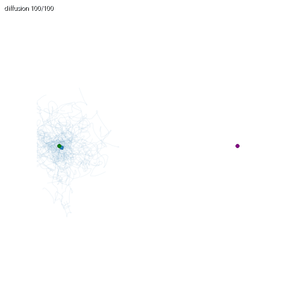<br/><sub><b>Empty</b></sub></td>
      <td align="center" style="border: none;">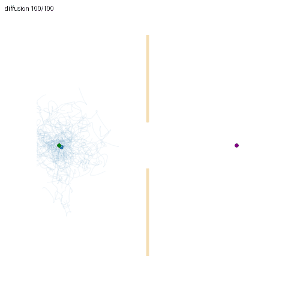<br/><sub><b>Narrow</b></sub></td>
      <td align="center" style="border: none;">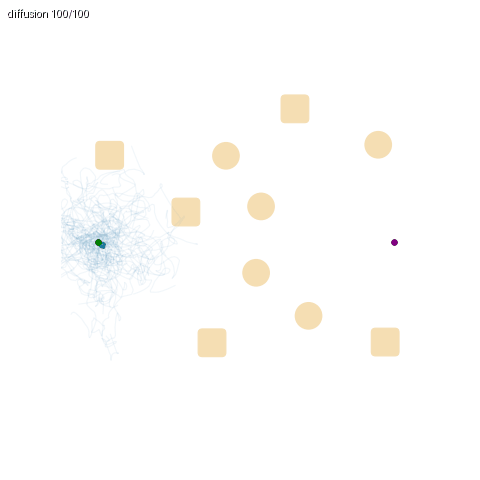<br/><sub><b>Random</b></sub></td>
      <td align="center" style="border: none;">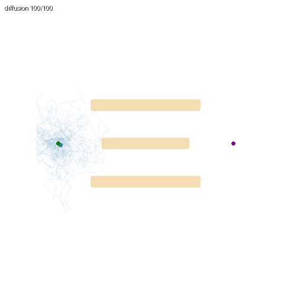<br/><sub><b>Conveyor</b></sub></td>
      <td align="center" style="border: none;">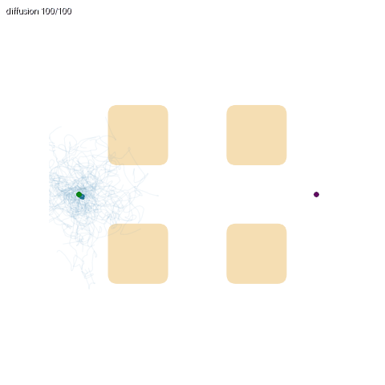<br/><sub><b>Drop Region</b></sub></td>
      <td align="center" style="border: none;">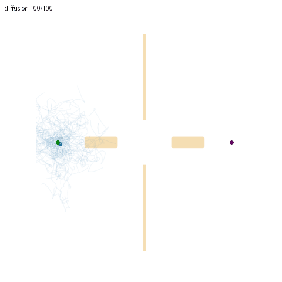<br/><sub><b>Tennis</b></sub></td>
    </tr>
  </table>
</p>

### Multi-Agent Planning with MDOC-CBS
<p align="center">
  <table align="center" style="border: none; border-collapse: collapse;">
    <tr>
      <td align="center" style="border: none;">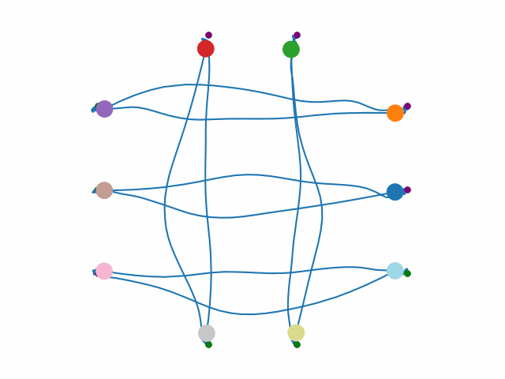<br/><sub><b>Empty</b> · 10 agents</sub></td>
      <td align="center" style="border: none;">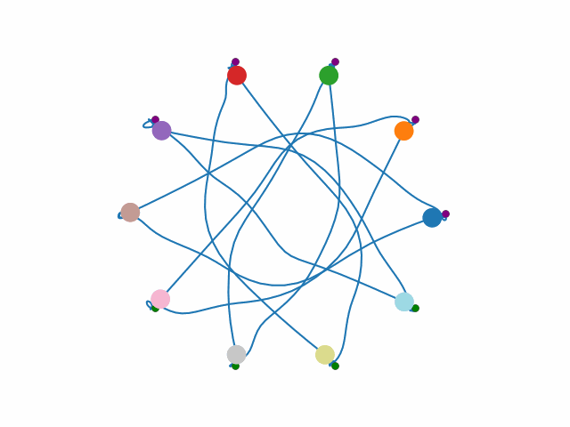<br/><sub><b>Empty</b> · 10 agents</sub></td>
      <td align="center" style="border: none;">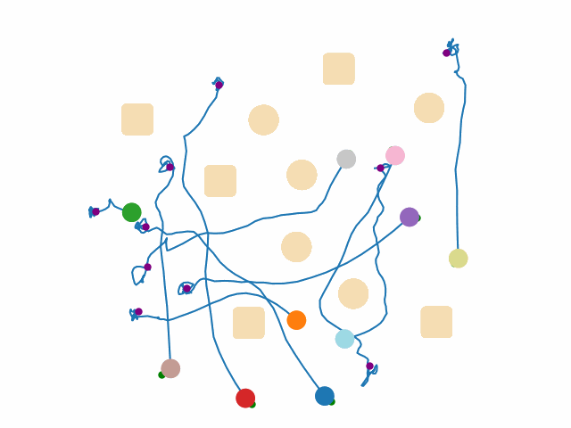<br/><sub><b>Random</b> · 10 agents</sub></td>
      <td align="center" style="border: none;">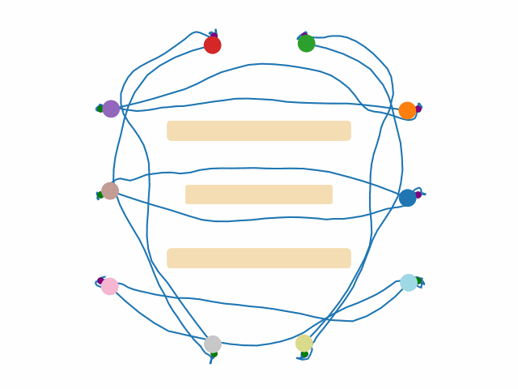<br/><sub><b>Conveyor</b> · 10 agents</sub></td>
    </tr>
    <tr>
      <td align="center" style="border: none;">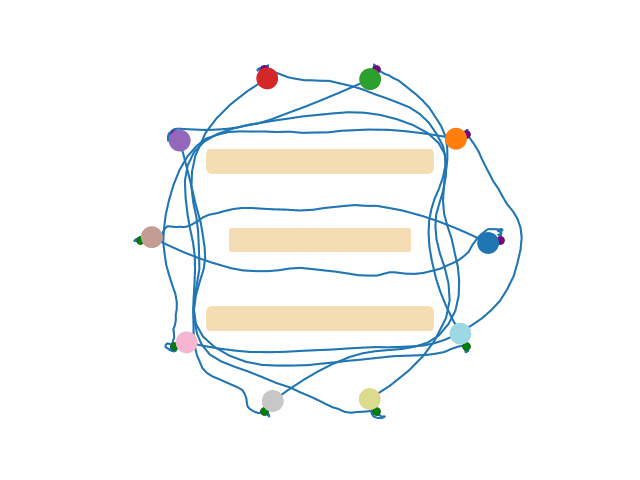<br/><sub><b>Conveyor</b> · 10 agents</sub></td>
      <td align="center" style="border: none;">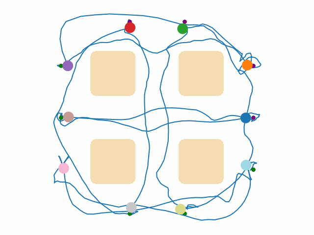<br/><sub><b>Drop Region</b> · 10 agents</sub></td>
      <td align="center" style="border: none;">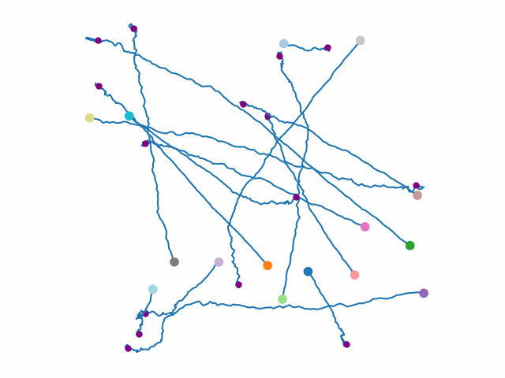<br/><sub><b>Empty-Large</b> · 15 agents</sub></td>
      <td align="center" style="border: none;">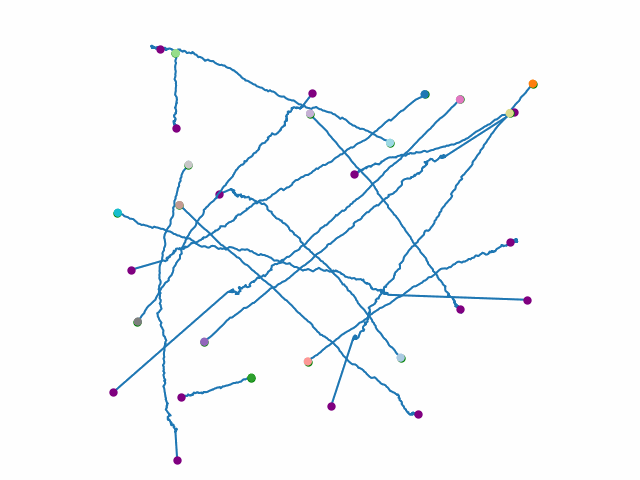<br/><sub><b>Empty-XL</b> · 15 agents</sub></td>
    </tr>
  </table>
</p>

---

## Updates

- **[2026-04-27]** The work has been accepted to **RSS 2026** and open-sourced. 🎉🎉 The final version will be uploaded to arXiv shortly. The current manuscript is available on [Google Drive](https://drive.google.com/file/d/10DiuwkccMDNBFkTMfXRTj7f8gO1TCah_/view?usp=sharing).

---

## Installation

**Requirements**
- Python ≥ 3.10

**Tested configurations**
- Ubuntu 22.04
- CUDA 11.8.0 / 12.1.1
- PyTorch 2.1.0 / 2.2.0

**Setup**
```bash
./scripts/bash/setup.sh
```

---

## Architecture Overview

The MDOC framework is organized into three hierarchical layers, where each layer delegates to the next.

| Layer | Module | Responsibility |
| :--- | :--- | :--- |
| Multi-Agent Coordination | [`mdoc/planners/multi_agent/cbs.py`](mdoc/planners/multi_agent/cbs.py) | Conflict-Based Search (CBS) for resolving inter-agent conflicts. |
| Single-Agent Planning | [`mdoc/planners/single_agent/mdoc_ensemble.py`](mdoc/planners/single_agent/mdoc_ensemble.py) | Per-agent trajectory planning via the MDOC ensemble interface. |
| Diffusion Optimal Control | [`mdoc/models/diffusion_models/mbd_ensemble.py`](mdoc/models/diffusion_models/mbd_ensemble.py) | Core model-based diffusion optimal control implementation. |

```
       cbs.py         ──▶     mdoc_ensemble.py     ──▶     mbd_ensemble.py
(multi-agent: MDOC-CBS)     (single-agent: MDOC)            (MDOC core)
```

---

## Reproduce Our Experiments

```bash
./scripts/run_experiments.sh
```

> [!NOTE]
> Running the full experiment suite end-to-end takes a long time. We recommend executing the commands individually or reducing the number of trials per configuration.

The dataset for reproducing **MMD-CBS** baselines is available on [Google Drive](https://drive.google.com/file/d/10DiuwkccMDNBFkTMfXRTj7f8gO1TCah_/view?usp=sharing). Please refer to the upstream [MMD repository](https://github.com/yoraish/mmd) for further details.

---

## Run With Your Own Environment

Plan in a custom environment in four steps.

### 1. Define the environment
Add a new environment module under [`deps/torch_robotics/torch_robotics/environments/`](deps/torch_robotics/torch_robotics/environments/), subclassing `EnvBase`. Specify the workspace `limits`, fixed obstacles (`MultiSphereField` / `MultiBoxField`), and any planner-specific parameters. Use [`env_empty_2d.py`](deps/torch_robotics/torch_robotics/environments/env_empty_2d.py) as a minimal template.

### 2. Register the environment
Add an entry to the `EnvironmentType` enum in [`scripts/__init__.py`](scripts/__init__.py) so it becomes selectable from the CLI:
```python
class EnvironmentType(Enum):
    MY_ENV = "EnvMy2DRobotPlanarDisk"   # value must match the registered env class name
```

### 3. Configure start / goal states
Choose one of the built-in samplers in [`mdoc/common`](mdoc/common/) — `get_start_goal_pos_circle`, `get_start_goal_pos_boundary`, or `get_start_goal_pos_random_in_env` — or pass explicit positions through the `--start_positions` / `--goal_positions` arguments of [`scripts/inference/inference_multi_agent.py`](scripts/inference/inference_multi_agent.py).

### 4. Launch inference
```bash
python scripts/inference/launch_multi_agent_experiment.py \
  --n 10 \
  --e EnvMy2DRobotPlanarDisk \
  --hps CBS \
  --lps MDOCEnsemble \
  --rl 1000 \
  --nt 10 \
  --ra
```

| Flag | Description | Choices / Example |
| :--- | :--- | :--- |
| `--n`   | Number(s) of agents                | `10` or `5 10 15` |
| `--e`   | Environment (registered in step 2) | `EnvMy2DRobotPlanarDisk` |
| `--hps` | High-level (multi-agent) planner   | `CBS`, `ECBS`, `XCBS`, `XECBS`, `PP` |
| `--lps` | Low-level (single-agent) planner   | `MDOCEnsemble`, `MMDEnsemble`, `KCBSLower`, `WAStar`, `WAStarData` |
| `--rl`  | Runtime limit (seconds)            | `1000` |
| `--nt`  | Trials per configuration           | `10` |
| `--ra`  | Render animation                   | flag |

See [`scripts/run_experiments.sh`](scripts/run_experiments.sh) for the full set of planner / environment combinations used in the paper.

---

## Citation

If you find our work useful in your research, please cite:

```bibtex
@inproceedings{he2026mdoc,
  title     = {Model-Based Diffusion Optimal Control for Multi-Robot Motion Planning},
  author    = {He, Zhilin and Shaoul, Yorai and Li, Jiaoyang},
  booktitle = {Robotics: Science and Systems (RSS)},
  year      = {2026}
}
```

---

## Acknowledgments

This codebase builds upon **[Multi-Robot Motion Planning with Diffusion Models (MMD)](https://github.com/yoraish/mmd)**. We thank the authors for open-sourcing their work and for making it easy to extend. The original license is included in the [`LICENSE`](LICENSE) file of this repository.
